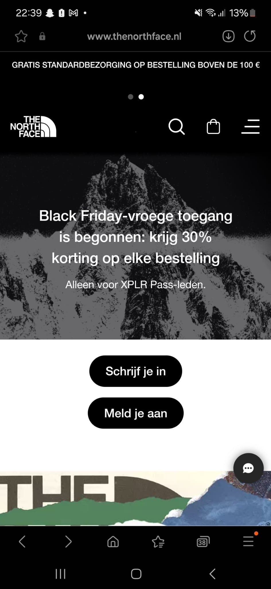
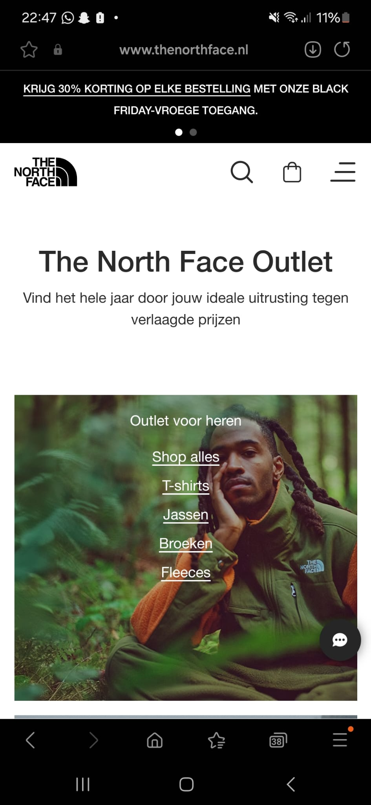

# Procesverslag
Markdown is een simpele manier om HTML te schrijven.  
Markdown cheat cheet: [Hulp bij het schrijven van Markdown](https://github.com/adam-p/markdown-here/wiki/Markdown-Cheatsheet).

Nb. De standaardstructuur en de spartaanse opmaak van de README.md zijn helemaal prima. Het gaat om de inhoud van je procesverslag. Besteedt de tijd voor pracht en praal aan je website.

Nb. Door *open* toe te voegen aan een *details* element kun je deze standaard open zetten. Fijn om dat steeds voor de relevante stuk(ken) te doen.

## Jij

  
uitwerken voor kick-off werkgroep

  ### Auteur:
  Tom Heine (vervangen door jouw naam)

  #### Je startniveau:
  blauw/rood (kies uit zwart, rood óf blauw)

  #### Je focus:
  responsive (kies uit responsive óf surface plane)
 

## Je website

  
uitwerken voor kick-off werkgroep

  ### Je opdracht:
https://www.thenorthface.nl/nl-nl
  #### Screenshot(s) van de eerste pagina (small screen): 
  Hoofdpagina  
  

  #### Screenshot(s) van de tweede pagina (small screen):
  Outletpagina  
  
 

## Toegankelijkheidstest 1/2 (week 1)

  
uitwerken na test in 2e werkgroep

  ### Bevindingen
  Lijst met je bevindingen die in de test naar voren kwamen:
  - De site gebruikt geen semantische HTML
  - De site heeft geen h1 element
  - Geen alt-description
  - Video kan niet op pauze
  - Video heeft geen captions
  - Links zijn niet "recognizable" als links (geen streepjes)(waarschijnlijk voor uiterlijk doelen gedaan)
  - Maakt geen gebruik van focus states
  - Geen dark of light mode
  - Bepaalde tekst niet in juiste taal (Nederlands)

## Breakdownschets (week 1)

  
uitwerken na afloop 3e werkgroep

  ### de hele pagina: 
  

  ### dynamisch deel (bijv menu): 
  

  ### wellicht nog een dynamisch deel (bijv filter): 
  

## Voortgang 1 (week 2)

  
uitwerken voor 1e voortgang

  ### Stand van zaken
  hier dit ging goed & dit was lastig (neem ook screenshots op van delen van je website en code)
  Het maken van de HTML ging eigenlijk best soepel en zonder problemen. Ik ben nog niet echt begonnen met de css maar die komt nog wel

  ### Agenda voor meeting
  samen met je groepje opstellen

  | Mohammed       | Sander             | Esmee        | Tom              |
  | ---            | ---                | ---          | ---              |
  | -------------  | images, image sprites| Menu, footer | navigatie, foto's|
  | -------------- | content weghalen | video's      | animatie/gif     |
  | ...            | ...                | ...          | ...              |

  ### Verslag van meeting
  hier na afloop snel de uitkomsten van de meeting vastleggen

  - Alle images en video's kan je kopieren via ctrl + i en dan media
  - Article verdanderen in sections
  - De alt-tekst heeft een betere beschrijving nodig
  - Headers moeten bovenaan in de parent staan
  - Alle li items moeten ook nog a's worden in de footer
  - Alle / veranderen in ./
  - Het gifje/animatie is eigenlijk een video

## Voortgang 2 (week 3)

  
uitwerken voor 2e voortgang

  ### Stand van zaken
  hier dit ging goed & dit was lastig (neem ook screenshots op van delen van je website en code)
  Met de CSS ging het niet heel erg soepel en in dit deel van coderen voel ik me nog niet het sterkst. Ik probeer kennis van de oefeningen over te brengen voor in mijn website en dat lukt wel. Langzaam begint de site toch beetje bij beetje iets wat lijkt op de site. Tijdens de feedback heb ik dus niks kunnen laten zien van mijn site door het weinig css afhebben voor het feedbackmoment.

  ### Agenda voor meeting
  samen met je groepje opstellen

  | Mohammed       | Sander             | Esmee        | Tom              |
  | ---            | ---                | ---          | ---              |
  | @media         | Svg                |  eerste slider| Svg             |
  | individueel-   | Grid               | ⁠slider positie |                |
  | responsive     | ...                | ⁠video’s / form | ...            |

  ### Verslag van meeting
  hier na afloop snel de uitkomsten van de meeting vastleggen

  - punt 1
  - punt 2
  - nog een punt
- ...

## Toegankelijkheidstest 2/2 (week 4)

  
uitwerken na test in 9e werkgroep

  ### Bevindingen
  Lijst met je bevindingen die in de test naar voren kwamen (geef ook aan wat er verbeterd is):

## Voortgang 3 (week 4)

  
uitwerken voor 3e voortgang

  ### Stand van zaken
  hier dit ging goed & dit was lastig (neem ook screenshots op van delen van je website en code)

  ### Agenda voor meeting
  samen met je groepje opstellen

  | student 1      | student 2          | student 3    | student 4        |
  | ---            | ---                | ---          | ---              |
  | dit bespreken  | en dit             | en ik dit    | en dan ik dat    |
  | en dat ook nog | dit als er tijd is | nog een punt | dit wil ik zeker |
  | ...            | ...                | ...          | ...              |

  ### Verslag van meeting
  hier na afloop snel de uitkomsten van de meeting vastleggen

  - punt 1
  - punt 2
  - nog een punt
  - ...

## Eindgesprek (week 5)

  
uitwerken voor eindgesprek

  ### Je uitkomst - karakteristiek screenshots:
  

  ### Dit ging goed/Heb ik geleerd: 
  Korte omschrijving met plaatjes

  

  ### Dit was lastig/Is niet gelukt:
  Korte omschrijving met plaatjes

  

## Bronnenlijst

  
continu bijhouden terwijl je werkt

  Nb. Wees specifiek ('css-tricks' als bron is bijv. niet specifiek genoeg). 
  Nb. ChatGpT en andere AI horen er ook bij.
  Nb. Vermeld de bronnen ook in je code.

  1. bron 1
  2. bron 2
  3. ...

